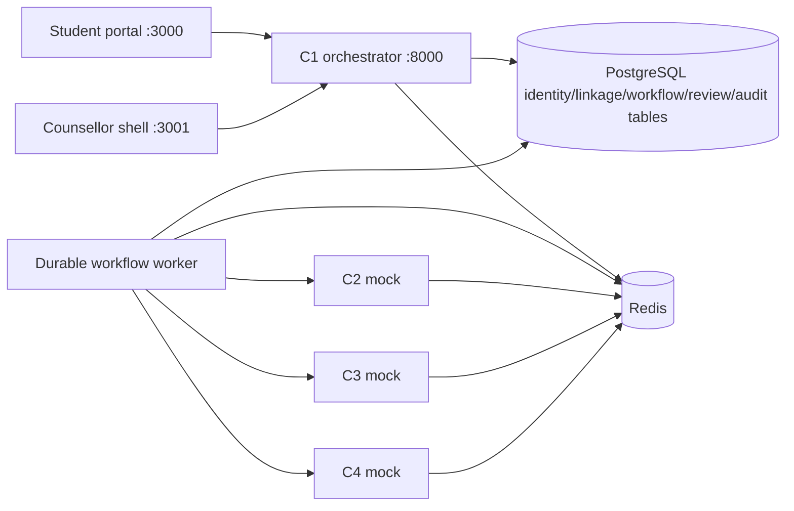

# Architecture

The monorepo has two Next.js shells, four FastAPI services, one narrow Python worker, PostgreSQL and Redis. REST/JSON contracts originate in shared Pydantic models and generate JSON Schema, OpenAPI 3.1 and TypeScript declarations. C2–C4 are deterministic mocks.

The orchestrator stores a fixture identifier with an atomic job/case/consent-link transaction. The worker materializes fixture text only in memory. It checks current consent at each stage, validates downstream context/version, and creates a review task only in the final successful transaction. Each case has a one-to-one consent decision and at most one workflow/review task.

PostgreSQL is the durable queue. A lease and attempt counter bound execution to three attempts. `FOR UPDATE SKIP LOCKED` claims jobs; case row locks serialize transitions with withdrawal. Service calls have a five-second timeout. Stale leases allow restart recovery; attempt fencing prevents a stale worker completing another attempt. FAILED plus DEAD_LETTER is the manual-resolution outcome. No automatic endless replay is permitted. Changes to transaction/lock ordering require concurrency tests.

Redis holds short-lived service-token status (60s), login counters (60s), worker heartbeat (120s) and harmless probe results (60s). It never holds submitted text. Redis is nonpersistent; a restart invalidates outstanding service tokens and resets rate counters, while PostgreSQL preserves jobs. No cloud telemetry exporter is configured.

Development limitations: one designated synthetic counsellor can be auto-assigned by environment; no general staff directory, production queue scaling, university identity integration, clinical taxonomy, model or explainer exists. Retention defaults to 24 hours for synthetic evidence, not an approved participant retention policy.
